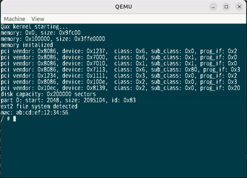

# A toy OS

Qux is a toy operating system for x64 written in zig.

### Build and run

- can only be built in Linux on x64 with grub installed. 
- the `kernel` directory contains the kernel source code
- the `boot` directory contains some utility for bootstrap. steps to build:
    - run `zig build` under `kernel` to build the kernel
    - `mkimg test.img` make a disk image named `test.img` with grub installed to boot the OS with multiboot2.
    - `build`  build everything under `boot` directory and copy the kernel to the disk image built above and start QEMU to run it

### What's implemented

- [x] basic memory management
- [x] basic process management/scheduling
- [x] basic ATA driver
- [x] ext2 file system
- [x] syscalls, trying to implement Linux syscalls, so that userspace programs for Linux could hopefully run on Qux 
- [x] basic ELF loader
- [x] use dash (recompiled with musl-gcc as static executable) as the shell
- [x] can run doom(doomgeneric), kind of :), key handling is still to be done
- [x] network stack: TCP, UDP, ICMP(ping), a simple webserver included

### TODO

- [ ] SMP support
- [ ] more syscalls
- [ ] implement dynamic loading so that linux programs can run without recompiling??
- [ ] port some usefull userspace programs

